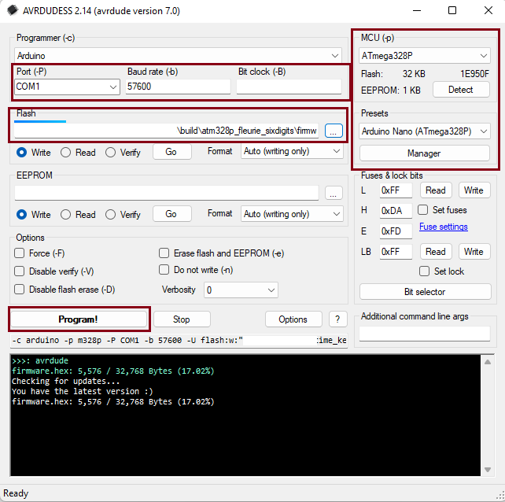
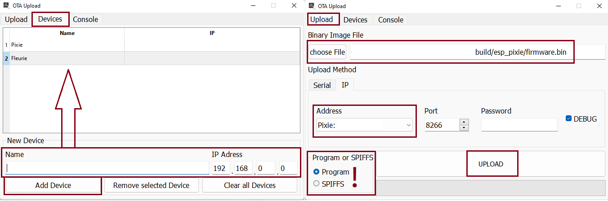
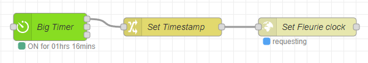

# Introduction
# Flashing

## Arduino
### Serial

1. Download this UI: [AVRDUDESS](https://github.com/ZakKemble/AVRDUDESS/releases).
2. Download the latest precompiled [`firmware.hex`](https://github.com/ambarusa/Time-Keeper/tree/master/build) file from one of the `build/atm328p_xxx` directories (depending on your clock type).
3. Open the flasher tool, and load the **Arduino Nano (ATmega328P)** preset (as it's on the right side of the screenshot above). This will set up the tool properly.
4. Choose the right COM port at the top.
5. Add the previously downloaded `firmware.hex` file under the Flash section.
5. Hit Program!, and wait!

## ESP8266
## Serial
Download the latest [`firmware.bin`](https://github.com/ambarusa/Time-Keeper/tree/master/build) file  from one of the `build/esp_xxx` directories (depending on your clock type). Then choose a tool to flash the device, for example:

- Tasmotizer ([Releases](https://github.com/tasmota/tasmotizer/releases))
- NodeMCU PyFlasher ([Releases](https://github.com/marcelstoer/nodemcu-pyflasher/releases))

### OTA Flashing
You can flash your device with OTA, if the current firmware running supports it (an older Time Keeper firmware, or just the BasicOTA.ino example sketch).

1. Download this UI: [ESP-Ota-UI](https://github.com/Nikfinn99/ESP-Ota-UI/releases).
2. Download the latest precompiled [`firmware.bin`](https://github.com/ambarusa/Time-Keeper/tree/master/build) file from one of the `build/esp_xxx` directories (depending on your clock type).
3. Open the Ota UI, go to Devices tab, and add your device by typing a name, and it's IP Address (see left side of the screenshot above).

**PLEASE BE CAREFUL AT THE FOLLOWING STEP**

1. Go back to the main Upload tab (right side of the screenshot above), choose the binary you want to flash, choose the device you added previously, and finally choose what type of binary you want to flash ([`firmware.bin`] = Program).
2. Hit Upload, and wait!

# Configuring

After plugging the clock in, it will try to connect to a previously stored Wi-Fi network, otherwise it will create an access point. The name of the AP will be the clock's type, Fleurie or Pixie, and 12345678 as password.

## Configuring without web UI:
* Passing Wi-Fi credentials to the device:\
`http://IP_ADDRESS/save_config?Wi-Fi=&ssid=SSID&pwd=Password`\
Change the values of `IP_ADDRESS` to the device's IP address, `ssid=` and `pwd=` to your network's credentials. If the device hasn't been connected to any network yet, then connect to the created Access Point, and change the `IP_ADDRESS` to `pixie.local` or `4.3.2.1`.

* Setting the clock to synchronize with an NTP server:\
`http://IP_ADDRESS/save_time?&manual=0&tz=1&server=0.europe.pool.ntp.org`\
Change the values of `IP_ADDRESS` to the device's IP address, `tz=` to your timezone, and `server=` to an NTP server.
    ### Examples:
  * http://fleurie.local/save_time?manual=0&tz=1&server=0.europe.pool.ntp.org
  * http://pixie.local/save_time?manual=1684355636

## Configuring with Node-RED:
The following flow from [@Andoramb](https://github.com/Andoramb) is updating Fleurie's time every morning at 8 a.m with HTTP_GET method, as described above. This could be helpful, if the clock is used in a network without internet connection. \

 Node-RED Export
<blockquote>
    [ { "id": "4f5c2c5f086ecd20", "type": "bigtimer", "z": "fc3ccd8498fc134b", "outtopic": "", "outpayload1": "on", "outpayload2": "off", "name": "Big Timer", "comment": "", "lat": "57.708870", "lon": "11.974560", "starttime": "480", "endtime": "0", "starttime2": 0, "endtime2": 0, "startoff": "0", "endoff": "0", "startoff2": 0, "endoff2": 0, "offs": "0", "outtext1": "255", "outtext2": "0", "timeout": "0", "sun": false, "mon": true, "tue": true, "wed": true, "thu": true, "fri": true, "sat": false, "jan": true, "feb": true, "mar": true, "apr": true, "may": true, "jun": true, "jul": true, "aug": true, "sep": true, "oct": true, "nov": true, "dec": true, "day1": 0, "month1": 0, "day2": 0, "month2": 0, "day3": 0, "month3": 0, "day4": 0, "month4": 0, "day5": 0, "month5": 0, "day6": 0, "month6": 0, "day7": 0, "month7": 0, "day8": 0, "month8": 0, "day9": 0, "month9": 0, "day10": 0, "month10": 0, "day11": 0, "month11": 0, "day12": 0, "month12": 0, "d1": 0, "w1": 0, "d2": 0, "w2": 0, "d3": 0, "w3": 0, "d4": 0, "w4": 0, "d5": 0, "w5": 0, "d6": 0, "w6": 0, "xday1": 0, "xmonth1": 0, "xday2": 0, "xmonth2": 0, "xday3": 0, "xmonth3": 0, "xday4": 0, "xmonth4": 0, "xday5": 0, "xmonth5": 0, "xday6": 0, "xmonth6": 0, "xday7": 0, "xmonth7": 0, "xday8": 0, "xmonth8": 0, "xday9": 0, "xmonth9": 0, "xday10": 0, "xmonth10": 0, "xday11": 0, "xmonth11": 0, "xday12": 0, "xmonth12": 0, "xd1": 0, "xw1": 0, "xd2": 0, "xw2": 0, "xd3": 0, "xw3": 0, "xd4": 0, "xw4": 0, "xd5": 0, "xw5": 0, "xd6": 0, "xw6": 0, "suspend": false, "random": false, "randon1": false, "randoff1": false, "randon2": false, "randoff2": false, "repeat": true, "atstart": true, "odd": false, "even": false, "x": 220, "y": 280, "wires": [ [ "088b341409c18726" ], [], [] ] }, { "id": "088b341409c18726", "type": "change", "z": "fc3ccd8498fc134b", "name": "Set Timestamp", "rules": [ { "t": "set", "p": "payload", "pt": "msg", "to": "$round(stamp/1000)", "tot": "jsonata" } ], "action": "", "property": "", "from": "", "to": "", "reg": false, "x": 420, "y": 280, "wires": [ [ "bad5cd7241c22de9" ] ] }, { "id": "bad5cd7241c22de9", "type": "http request", "z": "fc3ccd8498fc134b", "name": "Set Fleurie clock", "method": "GET", "ret": "txt", "paytoqs": "ignore", "url": "http://fleurie.local/save_time?manual={{{payload}}}", "tls": "", "persist": false, "proxy": "", "insecureHTTPParser": false, "authType": "", "senderr": false, "headers": [], "x": 640, "y": 280, "wires": [ [] ] } ]
</blockquote>

