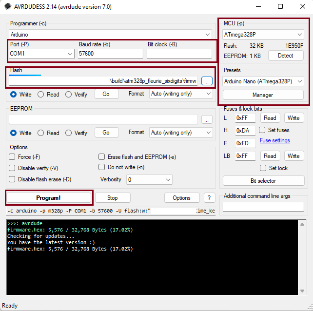
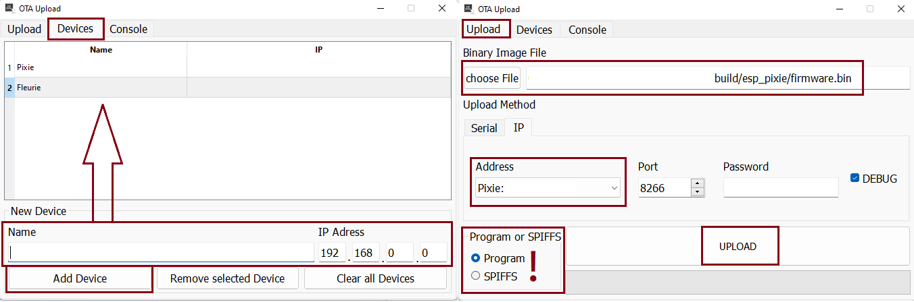
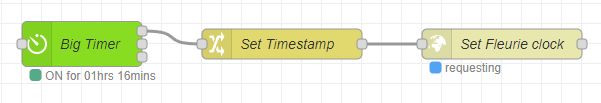

# Time-Keeper

Time-Keeper is firmware for Nixie and VFD clock builds based on two hardware families:

- `arduino/`: standalone ATmega328P firmware for clock control.
- `esp/`: ESP-based network firmware with web UI, Wi-Fi setup, NTP sync, OTA update support, and MQTT integration.

The repository also includes prebuilt release artifacts under `build/` for the main supported variants.

## What this repository contains

### AVR firmware

The AVR project targets Arduino Pro compatible ATmega328P boards and is built with PlatformIO.

Supported build environments:

- `atm328p_pixie_fourdigits`
- `atm328p_pixie_sixdigits`
- `atm328p_fleurie_sixdigits`

### ESP firmware

The ESP project adds networked features to the clock:

- captive portal style first-time setup
- browser-based control UI
- NTP synchronization or manual time setting
- MQTT support
- OTA firmware updates

Supported build environments in source:

- `esp_fleurie`
- `esp_pixie`
- `esp32_fleurie`
- `esp32_pixie`
- `esp_fleurie_debug`
- `esp_pixie_debug`

Prebuilt binaries currently present in `build/`:

- `build/esp_fleurie`
- `build/esp_pixie`

## Repository layout

```text
README.md            Project overview and setup notes
arduino/             AVR firmware for ATmega328P based clocks
esp/                 ESP firmware, web UI, networking, MQTT
build/               Precompiled output files copied from PlatformIO builds
docs/                Extra documentation, screenshots, and hardware notes
```

## Choosing the right firmware

Use the environment that matches both the display type and controller platform.

| Clock type | Controller | Environment |
| --- | --- | --- |
| Pixie, 4 digits | ATmega328P | `atm328p_pixie_fourdigits` |
| Pixie, 6 digits | ATmega328P | `atm328p_pixie_sixdigits` |
| Fleurie, 6 digits | ATmega328P | `atm328p_fleurie_sixdigits` |
| Pixie | ESP8266 | `esp_pixie` |
| Fleurie | ESP8266 | `esp_fleurie` |
| Pixie | ESP32 | `esp32_pixie` |
| Fleurie | ESP32 | `esp32_fleurie` |

## Flashing prebuilt firmware

### AVR / Arduino Nano

The simplest Windows workflow is AVRDUDESS.



1. Download [AVRDUDESS](https://github.com/ZakKemble/AVRDUDESS/releases).
2. Download the matching `firmware.hex` from one of the `build/atm328p_*` folders.
3. Open AVRDUDESS and load the Arduino Nano / ATmega328P preset.
4. Select the correct COM port.
5. Choose the `firmware.hex` file under the Flash section.
6. Program the device.

If you are building locally, you can also upload directly with PlatformIO:

```bash
cd arduino
pio run -e atm328p_pixie_fourdigits -t upload
```

### ESP8266 / ESP32 over serial

Use the matching `firmware.bin` from `build/esp_*`, or build it locally.

Common Windows flash tools:

- [Tasmotizer](https://github.com/tasmota/tasmotizer/releases)
- [NodeMCU PyFlasher](https://github.com/marcelstoer/nodemcu-pyflasher/releases)

If you are building locally, PlatformIO upload works as well:

```bash
cd esp
pio run -e esp_fleurie -t upload
```

### ESP OTA update

OTA flashing works if the device is already running firmware with OTA support.



1. Download [ESP-Ota-UI](https://github.com/Nikfinn99/ESP-Ota-UI/releases).
2. Download the matching `firmware.bin` from `build/esp_*`.
3. Add the device in the OTA tool using its IP address.
4. **Note:** ESP8266 uses port 8266 as the upload port, while ESP32 uses port 3232.
5. Select the binary and upload it as the program image.

## First boot and network setup

On power-up, the ESP firmware tries to connect to previously saved Wi-Fi credentials.

If no saved network is available, it creates an access point:

- SSID: `Fleurie` or `Pixie`
- password: `12345678`
- captive portal address: `http://4.3.2.1`
- mDNS hostname: `http://fleurie.local` or `http://pixie.local`

## Web UI pages

The web UI is split into a few focused pages:

- `/`: light mode and brightness control
- `/time_config`: NTP server, timezone offset, or manual time mode
- `/net_settings`: Wi-Fi and MQTT configuration
- `/other`: restart device or reset stored settings

## Configuration without the web UI

The firmware exposes a few HTTP endpoints. Of these, `GET /save_time` is intended for simple automation; Wi-Fi and MQTT configuration are handled by POST routes in the web UI.

### Set time from an NTP server

```text
http://IP_ADDRESS/save_time?manual=0&tz=1&server=0.europe.pool.ntp.org
```

Meaning:

- `manual=0`: use NTP sync
- `tz=1`: timezone offset in hours
- `server=...`: NTP server hostname

Examples:

- `http://fleurie.local/save_time?manual=0&tz=1&server=0.europe.pool.ntp.org`
- `http://pixie.local/save_time?manual=0&tz=-5&server=pool.ntp.org`

### Set time manually

```text
http://IP_ADDRESS/save_time?manual=1711843200
```

The `manual` value is a Unix timestamp in seconds.

Notes:

- `GET /save_time` uses HTTP basic authentication.
- username: device name, `Fleurie` or `Pixie`
- password: `12345678`

## MQTT and Home Assistant

MQTT can be configured from the network settings page in the ESP web UI.

The repository includes a separate Home Assistant integration note in [docs/README.md](./docs/README.md), including:

- Mosquitto setup
- Home Assistant MQTT configuration
- an example `light` entity for Fleurie

## Node-RED example

If the clock runs on a network without internet access, you can still push time updates from another system. The original Node-RED example is kept below because it is still useful for manual timestamp updates.

The flow from [@Andoramb](https://github.com/Andoramb) updates Fleurie every morning at 08:00 using `GET /save_time`.



<details><summary>Node-RED export</summary><blockquote>
  [ { "id": "4f5c2c5f086ecd20", "type": "bigtimer", "z": "fc3ccd8498fc134b", "outtopic": "", "outpayload1": "on", "outpayload2": "off", "name": "Big Timer", "comment": "", "lat": "57.708870", "lon": "11.974560", "starttime": "480", "endtime": "0", "starttime2": 0, "endtime2": 0, "startoff": "0", "endoff": "0", "startoff2": 0, "endoff2": 0, "offs": "0", "outtext1": "255", "outtext2": "0", "timeout": "0", "sun": false, "mon": true, "tue": true, "wed": true, "thu": true, "fri": true, "sat": false, "jan": true, "feb": true, "mar": true, "apr": true, "may": true, "jun": true, "jul": true, "aug": true, "sep": true, "oct": true, "nov": true, "dec": true, "day1": 0, "month1": 0, "day2": 0, "month2": 0, "day3": 0, "month3": 0, "day4": 0, "month4": 0, "day5": 0, "month5": 0, "day6": 0, "month6": 0, "day7": 0, "month7": 0, "day8": 0, "month8": 0, "day9": 0, "month9": 0, "day10": 0, "month10": 0, "day11": 0, "month11": 0, "day12": 0, "month12": 0, "d1": 0, "w1": 0, "d2": 0, "w2": 0, "d3": 0, "w3": 0, "d4": 0, "w4": 0, "d5": 0, "w5": 0, "d6": 0, "w6": 0, "xday1": 0, "xmonth1": 0, "xday2": 0, "xmonth2": 0, "xday3": 0, "xmonth3": 0, "xday4": 0, "xmonth4": 0, "xday5": 0, "xmonth5": 0, "xday6": 0, "xmonth6": 0, "xday7": 0, "xmonth7": 0, "xday8": 0, "xmonth8": 0, "xday9": 0, "xmonth9": 0, "xday10": 0, "xmonth10": 0, "xday11": 0, "xmonth11": 0, "xday12": 0, "xmonth12": 0, "xd1": 0, "xw1": 0, "xd2": 0, "xw2": 0, "xd3": 0, "xw3": 0, "xd4": 0, "xw4": 0, "xd5": 0, "xw5": 0, "xd6": 0, "xw6": 0, "suspend": false, "random": false, "randon1": false, "randoff1": false, "randon2": false, "randoff2": false, "repeat": true, "atstart": true, "odd": false, "even": false, "x": 220, "y": 280, "wires": [ [ "088b341409c18726" ], [], [] ] }, { "id": "088b341409c18726", "type": "change", "z": "fc3ccd8498fc134b", "name": "Set Timestamp", "rules": [ { "t": "set", "p": "payload", "pt": "msg", "to": "$round(stamp/1000)", "tot": "jsonata" } ], "action": "", "property": "", "from": "", "to": "", "reg": false, "x": 420, "y": 280, "wires": [ [ "bad5cd7241c22de9" ] ] }, { "id": "bad5cd7241c22de9", "type": "http request", "z": "fc3ccd8498fc134b", "name": "Set Fleurie clock", "method": "GET", "ret": "txt", "paytoqs": "ignore", "url": "http://fleurie.local/save_time?manual={{{payload}}}", "tls": "", "persist": false, "proxy": "", "insecureHTTPParser": false, "authType": "", "senderr": false, "headers": [], "x": 640, "y": 280, "wires": [ [] ] } ]
</blockquote></details>

## Notes

- The ESP UI is generated from the files in `esp/data/` and embedded into firmware during build.
- Build artifacts are copied into `build/` by the PlatformIO post-build scripts for easier distribution.
- The `docs/` folder contains screenshots and extra hardware-related reference files.
